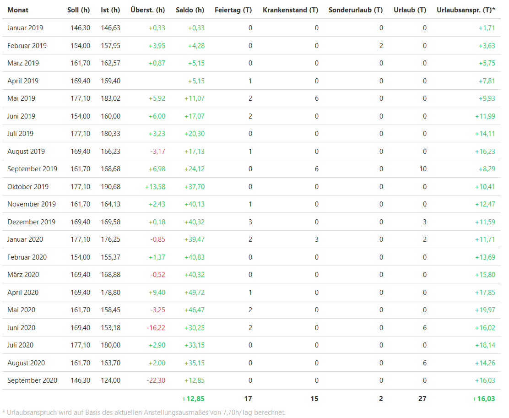
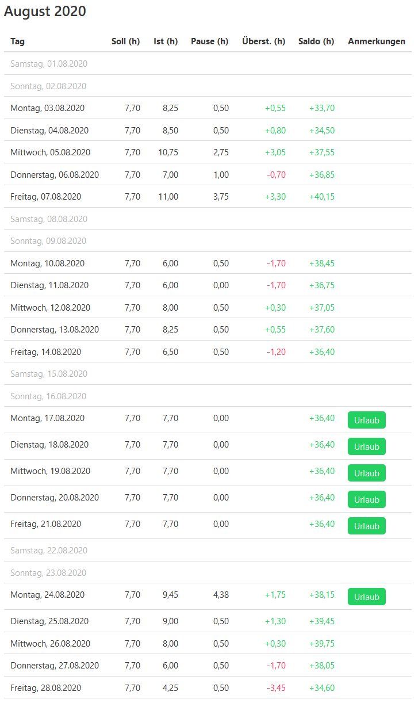

# Togglr

Togglr is our tool to fetch time entries from Toggl Track (www.toggl.com) and generates nice-looking HTML reports for each team member.

Toggl Track is very powerful and nice to use when tracking the time spent on working on specific projects. But Toggl Track is incredibly bad to use it to track for remaining holidays or sick days of specific team members, because it's missing the required kinds of reports. This is especially true for all the little quirks of Austrian labor laws, like the requirement that one needs to make a break after 6 hours of work time.

This is were Togglr comes it. We use it to calculate and document all working time for our employees, as required by Austrian laws. And we use it to easily calculate remaining holidays or overtime for our employees, even if this employees work only part-time or have changing working times in different months.

Togglr generates a nice looking HTML file for each team member. There's an overview, and a detailed list for each month:




## Run as dotnet tool

This project can be packed and installed as `dotnet tool`. Therefore, please navigate to the project folder of `Adliance.Togglr` with your favourite terminal and enter the following commands.
```
dotnet pack
dotnet tool install --global --add-source ./nupkg adliance.togglr
```

Once installed as global tool, `togglr` can be used from the terminal by calling
```
togglr --help
```

## Commandline interface
Togglr CLI supportes functions to generate a template configuration and to generate a report using a certain configuration. Type `togglr -- help` to display the supported arguments.

```
togglr --help
Adliance.Togglr
Adliance GmbH

  generate-report           (Default Verb) Generate a report with specified configuration

  generate-configuration    Generate a template 'configuration.json' in the current folder

  help                      Display more information on a specific command.

  version                   Display version information.

Adliance.Togglr
Adliance GmbH

  --help       Display this help screen.

  --version    Display version information.
```

### Generate template configuration
To generate a configuration template, the command `generate-configuration` can be used. The configuration will be generated in by default in the current folder and named `configuration.json`. A custom target filename is also supported.
Please [edit the generated template configuration](#Configuration) to meet your needs.

```
togglr generate-configuration --help
Adliance.Togglr
Adliance GmbH

  -t, --targetFileName    (Default: configuration.json) Target filename of the configuration file

  --help                  Display this help screen.

  --version               Display version information.
```

### Generate a report with a configuration
Once there is a valid configuration, a report can be easily generated with the command `generate-report`. Just provide a configuration (`configuration.json` by default or set a custom path via arguments). Find the help output of this command next.
```
togglr generate-report --help
Adliance.Togglr
Adliance GmbH

  -c, --configuration    (Default: configuration.json) Path to configuration file

  --help                 Display this help screen.

  --version              Display version information.
```

## Configuration
Togglr requires a `configuration.json` file in its working directory with some required and some optional configuration. Please see the `example-configuration.json` for a full example of all configuration options.

### Required: Toggl Track API Token and Workspace ID
```
  "api_token": "your_toggl_api_token",
  "workspace_id": 1234567,
```

### Optional: Toggl projects for "special days"
While team members use Toggl to track their normal working time to work-related projects, they are also required to track "special days" (like holidays) to specific projects. The names of these projects are configurable with the configuration file:

```
  "project_vacation": "Urlaub",
  "project_special_vacation": "Sonderurlaub",
  "project_holiday": "Feiertag",
  "project_personal_holiday": "Persönlicher Feiertag",
  "project_sick": "Krankenstand",
  "project_doctor": "Arztbesuch",
```

### Required: Team Members
Each team member needs to be configured with his/her Toggl name and expected work time:
```
  "users:" [
    {
      "name": "Teammember 2",
      "begin": "2019-11-03",
      "hours_per_day": 7.7
    }
  ]
```

In addition, each team member can have different work times for different time spans. For example, if one employee chooses to work a few hours less in the summer time (which many of our employees choose to do):
```
  "users:" [
    {
      "name": "Teammember 1",
      "begin": "2017-04-03",
      "hours_per_day": 7.7,
      "different_work_times": [
        {
          "begin": "2019-06-01",
          "end": "2019-06-30",
          "hours_per_day": 2
        },
        {
          "begin": "2020-06-01",
          "end": "2022-06-30",
          "hours_per_day": 4
        }
      ]
    }
  ]
```